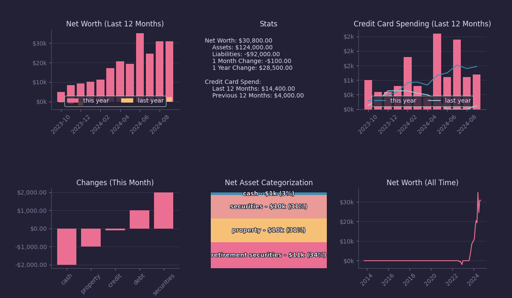

# AdvancedPF

Personal finance dashboard that visualizes financial data from CSV files.

## Quick Start

```bash
# Generate sample data and start server
just serve --generate-sample-data

# Visit http://localhost:8000/web/
```

**Or step by step:**
```bash
just generate-fake-data
just serve
```

## Features

- Interactive charts: net worth (all-time and last 12 months), asset allocation, cash flow, savings, taxes
- Multiple color themes (dropdown selector)
- Auto-validation of data integrity

## Data Management

### Sample Data

```bash
# Generate sample data and serve
just serve --generate-sample-data

# Generate sample data only
just generate-fake-data
```

Prompts for confirmation before overwriting any existing data in `data/`.

### Real Data (1Password Integration)

```bash
# Load data from 1Password
just load-real-data

# Edit files in data/

# Save back to 1Password
just save-real-data
```

The default 1Password item name is `AdvancedPF Data Backup`. Override:
```bash
export ITEM_NAME="Your Custom Item Name"
```

### Data Format

All data lives in `data/`. Files by type:

**Snapshot data** — `cash.csv`, `property.csv`, `debt.csv`, `securities.csv`
```
date,account,value
2024-01-01,/bank/checking,5000.00
```

**Event data** — `credit.csv` (spending is negative)
```
date,account,value
2024-01-15,/visa/credit_card,-120.50
```

**Account metadata** — `manifest.yaml`
```yaml
accounts:
  /bank/checking:
    type: cash
    retirement: false
    title: Checking Account

  /property/house:
    type: property
    retirement: false
    primary_residence_since: 2020-01-01   # omit if never primary residence
    primary_residence_until: 2023-06-01   # omit if still primary residence

  /house/mortgage:
    type: debt
    retirement: false
    debt_applies_to: /property/house

  /fidelity/401k:
    type: securities
    retirement: true
```
Account types: `cash`, `property`, `debt`, `securities`

**Annual income** — `income.csv`
```
year,total_income,federal_income_tax,state_income_tax,social_security,medicare
2024,130000,28600,7150,9932,1885
```

**Annual savings** — `savings.csv` (negative = withdrawal)
```
year,account,amount
2024,/fidelity/401k,22500
2024,/fidelity/brokerage,8000
```

## Architecture

**Stack:** Alpine.js · Chart.js · Papa Parse · html2canvas + jsPDF

**No build process** — all dependencies loaded via CDN.

```
Data Flow: CSV/YAML → dataLoader → dataProcessing → charts → display
```

Key files:
- `web/index.html` — app entry point, Alpine.js dashboard state
- `web/js/dataProcessing.js` — core data logic (SnapshotData, EventData, compute functions)
- `web/js/dataLoader.js` — loads and parses all data files
- `web/js/chart-*.js` — one file per chart
- `web/js/themes.js` — theme/color system
- `justfile` — task runner

See [AGENTS.md](AGENTS.md) for full architecture documentation.

---

## Legacy Python Version

The original Python/matplotlib version is preserved for reference in `main.py`. It is not actively maintained.

```bash
pip install -r requirements.txt
python main.py
```

Theme definitions used by the Python version live in `themes/`.


